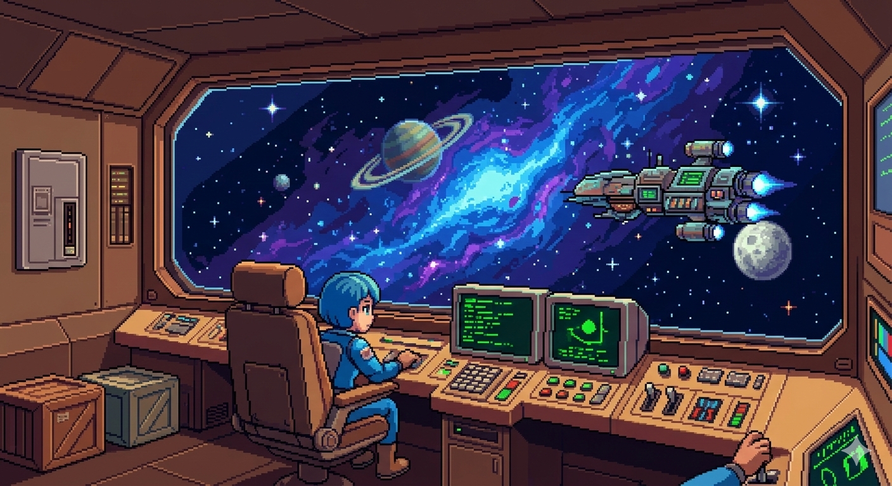
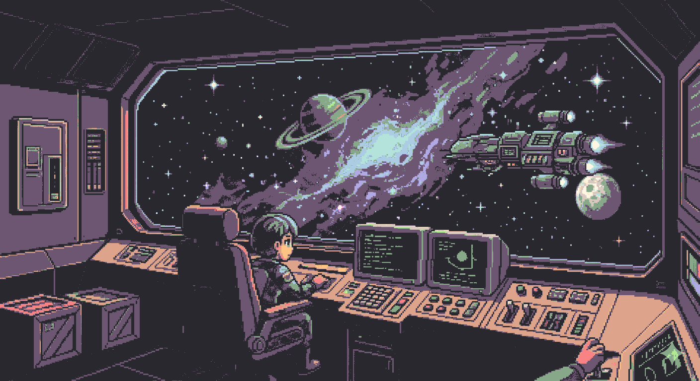
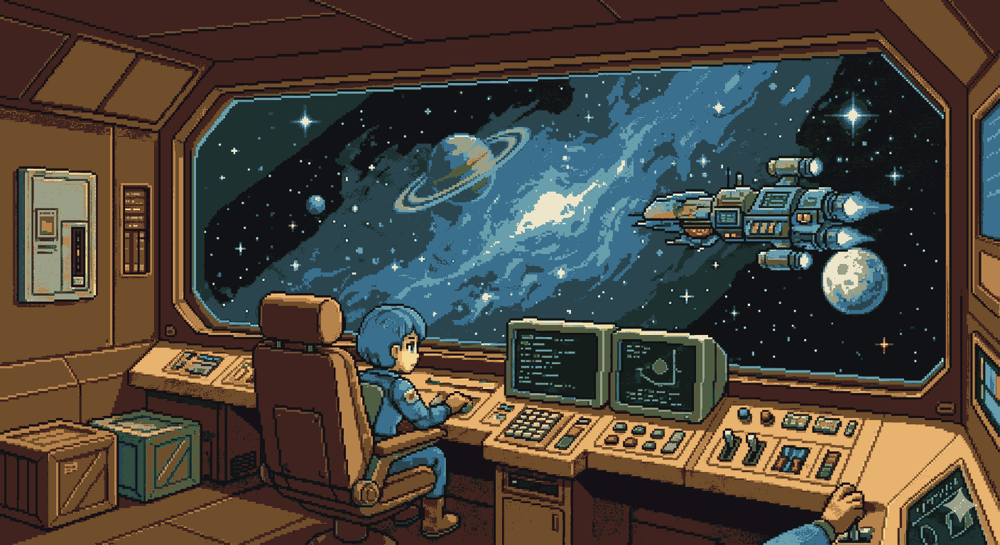

# palette-remap

Remap pixel-art / sprite image colors to a constrained palette — library, CLI, and MCP server.

## Examples

<table>
  <tr>
    <td align="center"><b>Original</b></td>
    <td align="center"><b><a href="https://lospec.com/palette-list/vanilla-milkshake">Vanilla Milkshake</a></b><br><sub>by Space Sandwich · 16 colors</sub></td>
    <td align="center"><b><a href="https://lospec.com/palette-list/galaxy-flame">Galaxy Flame</a></b><br><sub>by Rhoq · 16 colors</sub></td>
  </tr>
  <tr>
    <td></td>
    <td></td>
    <td></td>
  </tr>
</table>

> Images produced with:
> ```sh
> palette-remap original.png vanilla-milkshake.png \
>   --palette "#28282e #6c5671 #d9c8bf #f98284 #b0a9e4 #accce4 #b3e3da #feaae4 \
>              #87a889 #b0eb93 #e9f59d #ffe6c6 #dea38b #ffc384 #fff7a0 #fff7e4" \
>   --keep-transparency
>
> palette-remap original.png galaxy-flame.png \
>   --palette "#699fad #3a708e #2b454f #111215 #151d1a #1d3230 #314e3f #4f5d42 \
>              #9a9f87 #ede6cb #f5d893 #e8b26f #b6834c #704d2b #40231e #151015" \
>   --keep-transparency
> ```

## Library

```py
from palette_remap import remap_image, parse_palette

palette = parse_palette("#000 #fff #f00")
remap_image("input.png", "out.png", palette)
```

## CLI

```sh
palette-remap input.png output.png --palette "#000 #fff #f00"
palette-remap sprite.png result.png --palette-file retro.hex --keep-transparency
```

## MCP server

Exposes three tools so LLMs can remap images, inspect palettes, and analyze image colors.
All tools operate on **file paths**.

### Available tools

| Tool | Description |
|---|---|
| `remap_image_tool` | Remap every pixel to the nearest palette color. Takes `image_path` + `output_path`. |
| `preview_palette` | Parse and list colors from a hex string or file |
| `list_image_colors` | Rank the most frequent colors in an image. Takes `image_path`. |

### Recommended: pair with mcp/filesystem

Because the tools work with file paths, pair this server with
[`mcp/filesystem`](https://github.com/modelcontextprotocol/servers/tree/main/src/filesystem)
so the LLM can list directories, check what files exist, and pass correct absolute paths.

```json
{
  "mcpServers": {
    "filesystem": {
      "command": "npx",
      "args": ["-y", "@modelcontextprotocol/server-filesystem", "/path/to/your/images"]
    },
    "palette-remap": {
      "command": "palette-remap-mcp"
    }
  }
}
```

The LLM can then use `list_directory` from `filesystem` to discover image paths and feed them directly into `remap_image_tool` or `list_image_colors`.

### Run options

#### 1 · Direct — after `pip install`

```sh
pip install "palette-remap[mcp]"
```

`claude_desktop_config.json` (or equivalent MCP client config):

```json
{
  "mcpServers": {
    "filesystem": {
      "command": "npx",
      "args": ["-y", "@modelcontextprotocol/server-filesystem", "/path/to/your/images"]
    },
    "palette-remap": {
      "command": "palette-remap-mcp"
    }
  }
}
```

#### 2 · uvx — no install needed

```json
{
  "mcpServers": {
    "filesystem": {
      "command": "npx",
      "args": ["-y", "@modelcontextprotocol/server-filesystem", "/path/to/your/images"]
    },
    "palette-remap": {
      "command": "uvx",
      "args": ["--from", "palette-remap[mcp]", "palette-remap-mcp"]
    }
  }
}
```

#### 3 · Docker

Build once:

```sh
docker build -t palette-remap-mcp .
```

Then in your MCP client config (bind-mount your images folder to `/images` in both containers):

```json
{
  "mcpServers": {
    "filesystem": {
      "command": "docker",
      "args": [
        "run", "--rm", "-i",
        "--mount", "type=bind,src=/path/to/your/images,dst=/images",
        "mcp/filesystem", "/images"
      ]
    },
    "palette-remap": {
      "command": "docker",
      "args": [
        "run", "--rm", "-i",
        "--mount", "type=bind,src=/path/to/your/images,dst=/images",
        "palette-remap-mcp"
      ]
    }
  }
}
```

> **Note:** Both containers must mount the same host directory so paths like `/images/sprite.png` resolve identically in both servers.

## Dev setup

```sh
pip install -e ".[dev,mcp]"
pytest -q
ruff check palette_remap
mypy palette_remap
```
